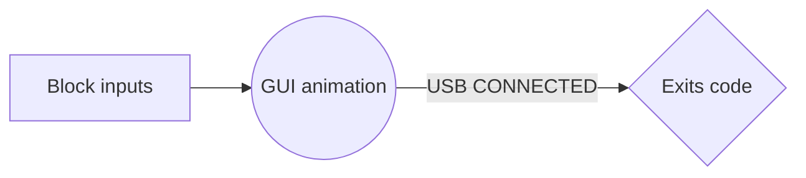

# DontTouchMe

**Not recommend to execute this script without setting an exit rule**.
else you will have to restart your computer

Build with **[AutoIt](https://www.autoitscript.com/site/)**. freeware BASIC-like scripting language. This sofware blocks all imputs from keyboard and mouse, instant closing Task Manager making impossible to interact with the computer while it display some ASCII arts.

Some key features:

- Block all keyboard and mouse inputs.
	> BlockInputEx.au3 https://github.com/J2TEAM/AutoIt-UDF-Collection/blob/master/UDF/SciLexer/BlockInputEx.au3

- Instant closes task manager.
	> ProcessClose("taskmgr.exe") https://www.autoitscript.com/autoit3/docs/functions/ProcessClose.htm
	
- Full Screen  GUI displaying ASCII arts.
	> ASCII arts source https://ascii.co.uk/art
	
- Exits code when specified USB plugged in.
	> COM Reference https://www.autoitscript.com/autoit3/docs/intro/ComRef.htm
	
# Work in progress

Code is not ready and barely tested.

More changes and optimization to come.

# Demo
